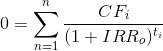

# Coding Challenge

## Installation

```bash
git clone git@github.com:acatus/coding_challenge.git
cd coding_challenge
bundle
```

```bash
rake db:create db:migrate db:seed
```

## Challenge

```
rspec
```

Calculate the internal rate of return and get the specs green!

### Additional Information

The irr is calculated with the following formula:

  

  - CF: cashflow amount
  - t: time in days (can be fractions) based on daycount convention 30/360 [1][1]
  - IRR: is the value to calculate [2][2]

[1]: https://en.wikipedia.org/wiki/Day_count_convention#30E/360
[2]: https://en.wikipedia.org/wiki/Internal_rate_of_return#Calculation
